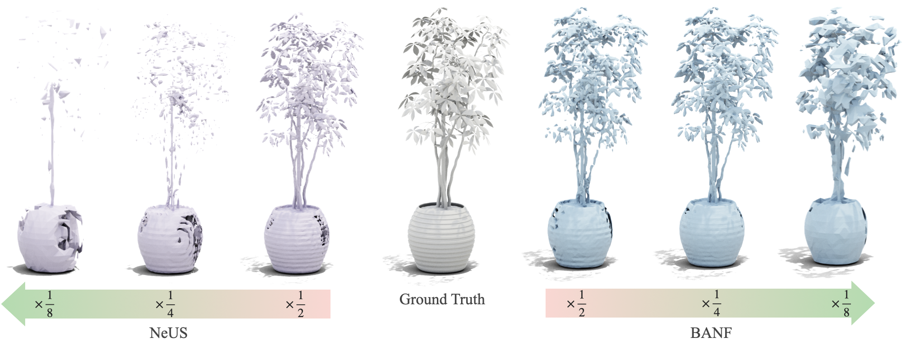

# BANF @ 3D Reconstruction


## Installation
To get started, clone the [SDFstudio](https://github.com/autonomousvision/sdfstudio) repository into your current directory and install it by following these steps:

```bash
# Cloning and setting the correct version of SDFstudio
git clone https://github.com/autonomousvision/sdfstudio ./
git checkout 370902a10dbef08cb3fe4391bd3ed1e227b5c165
```

Don't forget to also download the Blender dataset. You can find the installation instructions in the SDFstudio documentation.

## Usage
The Makefile contains all the training and validation processes. Here's how to utilize it:

### Training
Before diving into training, ensure you define the path to your training dataset:

```bash
export DATA_PATH="data/nerf_dataset/"
```

Then simply execute `make train` to initiate the training process. You can fine-tune the model's behavior by adjusting the hyperparameters within the Makefile.

### Evaluation
Evaluation follows a similar pattern. Start by defining the necessary paths:

```bash
export MODEL_DIR="path/to/the/checkpoint/"
export RES=64 # Grid resolution for extracting mesh
```

Once set, execute `make meshing` to reconstruct a 3D mesh from the checkpoint.