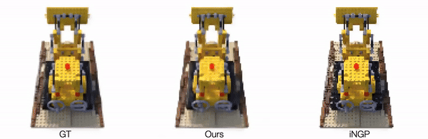

# BANF @ NeRFing



## Installation
Please note that this implementation is heavily based on [Kaolin Wisp repository](https://github.com/NVIDIAGameWorks/kaolin-wisp). To install all necessary dependencies, please follow their [installation guide](https://kaolin-wisp.readthedocs.io/en/latest/pages/install.html).

Also make sure to download Nerf Synthetic dataset.

## Usage
To train the model on all the Nerf Synthetic dataset, run the following command. It will run the training for all the objects in the dataset (up to 128 grid resolution) and render the final results.

```bash
objects=("ficus" "lego" "materials" "mic" "ship" "drums" "hotdog" "chair")


for obj in "${objects[@]}"
do
    echo "Processing $obj"
    python app/nerf/main_nerf.py \
        --dataset-path data/blender/$obj \
        --config app/nerf/configs/nerf_hash.yaml \
        --interactive False \
        --trainer.exp-name "${obj}_DCbounded" \
        --tracker.visualizer.render-res 128 128
done
```
