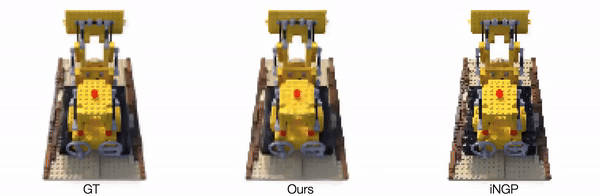
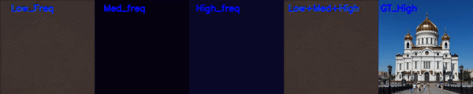

# BANF: Band-limited Neural Fields for Levels of Detail Reconstruction

| [Project Page](https://theialab.github.io/banf/) | [Paper](https://arxiv.org/abs/2404.13024) |

This is the official repository for the paper "Band-limited Neural Fields for Levels of Detail Reconstruction" (CVPR 2024).

We present our results in several settings. You can find more details in the respective directories.
* [NeRFing](NeRFing/README.md)




---

* [Multiview 3D reconstruction](3D_reconstruction/README.md)


---

* [2D Image Fitting](2D_fitting/README.md)




# Credits
This project is built on top of [SDFstudio](https://github.com/autonomousvision/sdfstudio) and [Kaolin Wisp](https://github.com/NVIDIAGameWorks/kaolin-wisp). We thank the maintainers for their contribution to the community!

# BibTeX
If you find BANF useful, please consider citing:
```
@article{ahan2023banf,
  author    = {Shabanov, Ahan and Govindarajan, Shrisudhan and Reading, Cody and Goli, Lily and Rebain, Daniel and Moo Yi, Kwang and Tagliasacchi, Andrea},
  title     = {BANF: Band-limited Neural Fields for Levels of Detail Reconstruction},
  year      = {2024},
  booktitle   = {The IEEE/CVF Conference on Computer Vision and Pattern Recognition (CVPR)},
}
```